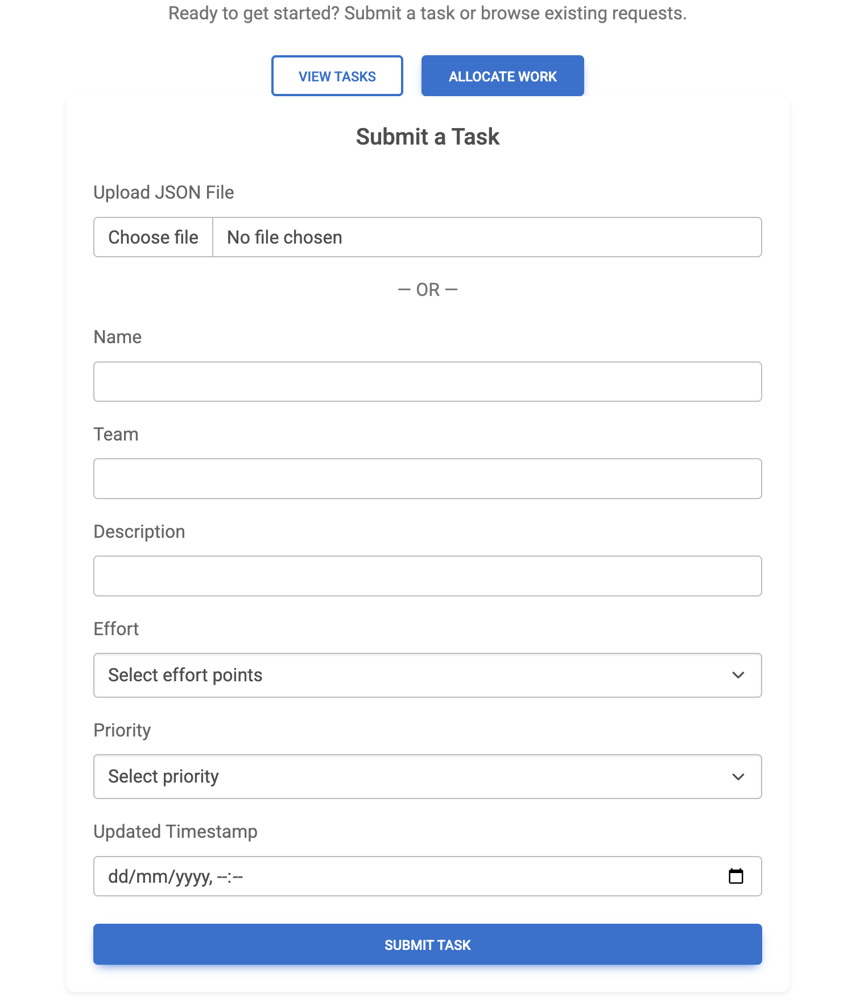
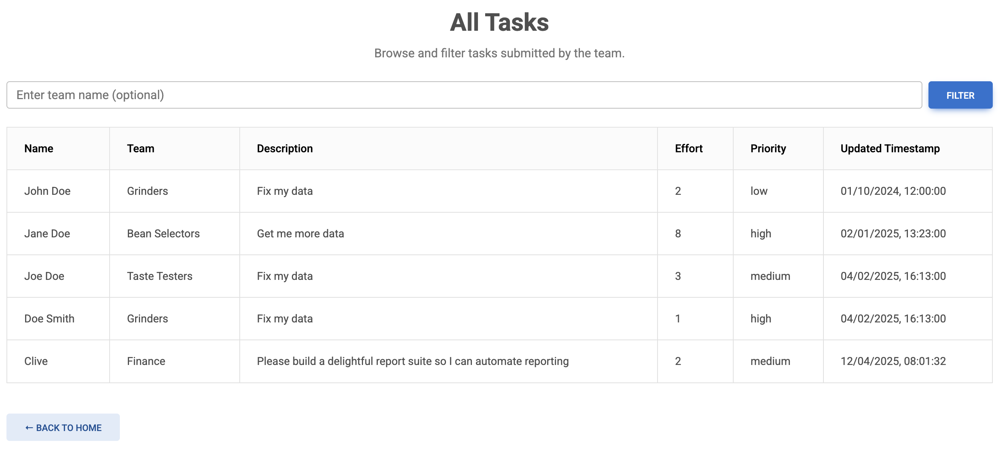
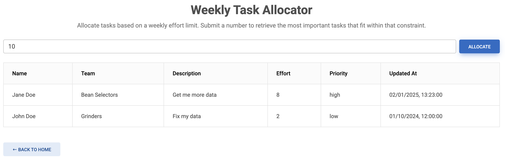

# 📚 Borrowed Beans Task Management

## 📖 Project Overview

This project provides a lightweight task management backend for the Data Platform team at **Borrowed Beans**. It helps organize, prioritize, and allocate weekly engineering tasks using an effort-based planning model. The core logic includes a Knapsack-based allocation algorithm and validations to ensure task consistency.

Built with **FastAPI**, **SQLite**, and **Docker**, the system supports both manual and bulk task creation, and enables optimal weekly task selection based on available effort.

---

## 🚀 Features

- ✅ Add tasks via manual **form input** or **bulk upload (JSON file only)**
- ✅ Filter tasks by team
- ✅ Task prioritization based on `priority` and `updated_timestamp`
- ✅ Allocate tasks weekly using a **0/1 Knapsack algorithm** (more details in `app/utils`)
- ✅ Frontend UI using HTML + JS (Fetch API)
- ✅ Validations to prevent bad data entry:

  - ✔️ Effort must be in the Fibonacci sequence (dynamically generated)
  - ✔️ No future `updated_timestamp` allowed
  - ✔️ No duplicates (same name, team, and timestamp)
  - ✔️ Duplicates blocked **within JSON file** and **against database**

- ✅ Logging for task creation and allocation
- ✅ Dockerized with support for containerized DB + backend
- ✅ GitHub Actions CI/CD for running tests and pushing image to Docker Hub

---

## 🖼️ User Interface

This project includes a lightweight frontend built with HTML and JavaScript (Fetch API). Users can:

- Upload tasks via form or JSON file
- Filter and view tasks
- Allocate tasks weekly using an effort limit

### Submit a Task



### All Tasks



### Weekly Task Allocator



---

## 🔌 API Testing with Swagger

FastAPI automatically generates an interactive Swagger UI for all API endpoints. You can test:

- Task creation (single or bulk)
- Task filtering
- Allocation logic

Visit [http://127.0.0.1:8000/docs](http://127.0.0.1:8000/docs) to explore.

---

## 🛠️ Setup Instructions

### ▶️ Local Setup

```bash
# Clone the repo
git clone https://github.com/squiz8/borrowed-beans-task-planner.git
cd borrowed-beans-task-planner

# Create a virtual environment
python -m venv venv
source venv/bin/activate  # On Windows: venv\Scripts\activate

# Install dependencies
pip install -r requirements.txt

# Run the app locally
fastapi dev app/main.py
```

Access: [http://127.0.0.1:8000](http://127.0.0.1:8000)

---

### ▶️ Run from DockerHub

```bash
# Pull from DockerHub
docker pull devsquiz/borrowed-beans-task-planner:latest

# Run using Docker
docker run -p 8000:8000 devsquiz/borrowed-beans-task-planner:latest
```

> ℹ️ The app uses an internal SQLite DB which is recreated each run for testing/demo purposes.

Access: [http://127.0.0.1:8000](http://l127.0.0.1:8000)

---

## ✅ Testing

This project supports **unit** tests using `pytest`.

### ▶️ Run All Tests

```bash
pytest tests/
```

### Unit Tests

Located in `tests/test_fibonacci.py`, `tests/test_knapsack.py`, and `tests/test_validators.py`:

#### What we test:

- Fibonacci sequence is generated dynamically and capped at 100
- Knapsack respects effort limits and selects optimal task set
- Validation catches:

  - Future timestamps
  - Duplicates in file

---

## 📁 Dataset

Two datasets provided for evaluation:

### `dataset_1.json` (Clean Sample)

Used to simulate a first-time upload with valid tasks and expected allocation results.

### `dataset_2.json` (Validation Trigger Sample)

Includes:

- ✅ A valid new task
- ❌ Task with future timestamp
- ❌ Duplicate task (in file and DB)
- ❌ Invalid effort not in Fibonacci sequence

> These datasets allow for thorough API testing during review.

---

## Suggested Enhancements for Deployment

If this MVP were to be deployed in a real-world environment, the following upgrades are recommended:

- **Authentication** — Add user authentication (e.g., JWT or OAuth2) to secure the system.
- **Database** — Switch from SQLite to **PostgreSQL** (e.g., Amazon RDS) for a production-ready relational DB.
- **Deployment** — Deploy the app backend using:

  - **AWS ECS Fargate** for containerized, serverless hosting

- **Secrets Management** — Store credentials using **AWS Secrets Manager** or **Vault**.

> These improvements are suggestions — many tools can solve these problems depending on team and infrastructure preference.
